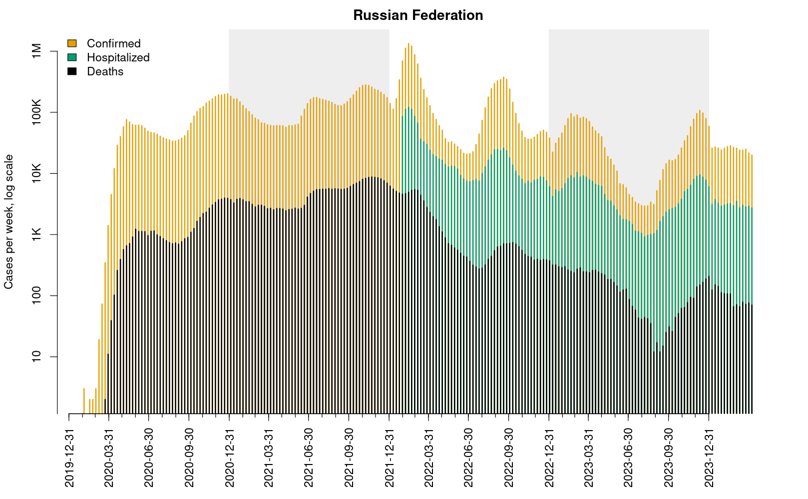
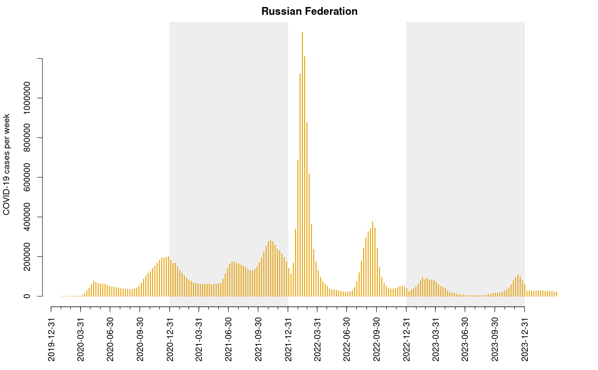
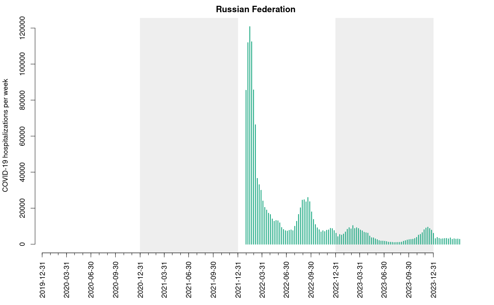
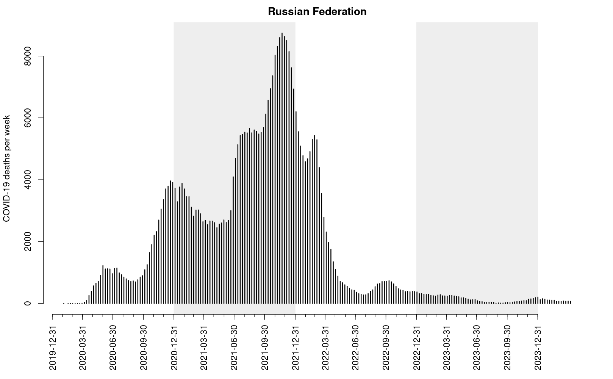
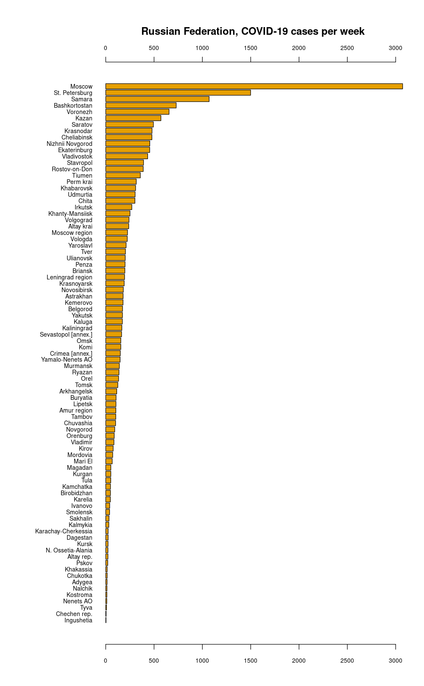
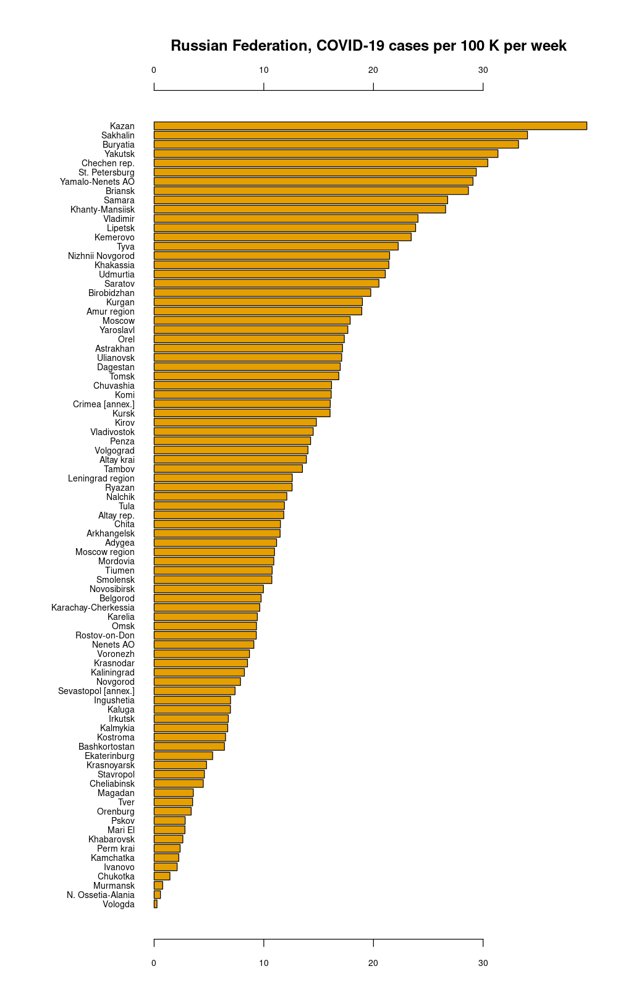
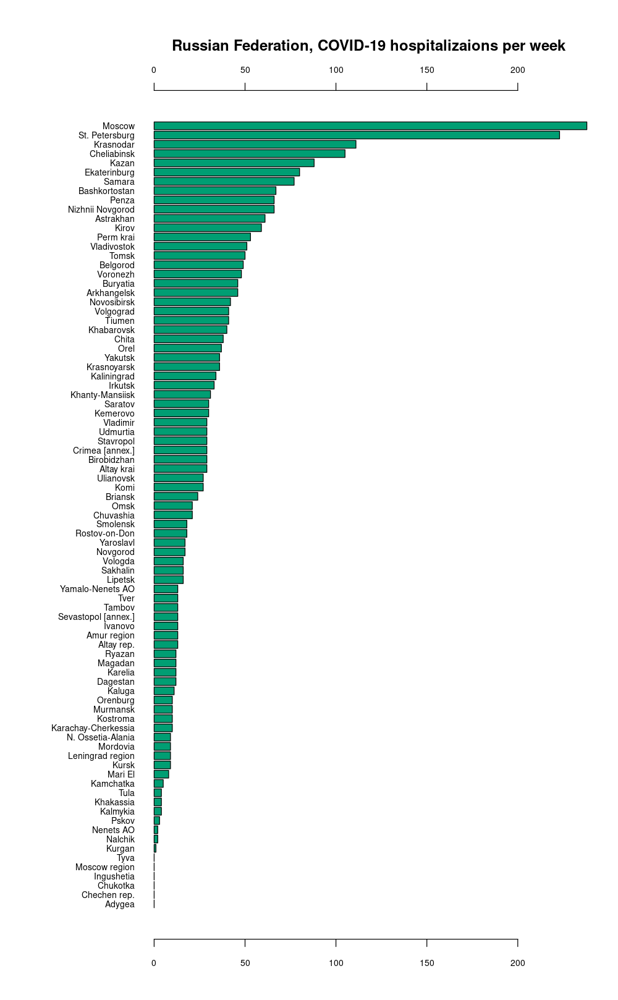

# Readme for COVID-2019.ru.ISOWeeks

To cite this repository in publications use:

    Kouprianov, A. (2023--). COVID-2019.ru.ISOWeeks : Coronavirus epidemics in Russia: weekly data and scripts.
    URL https://github.com/alexei-kouprianov/COVID-2019.ru.ISOWeeks

A BibTeX entry for LaTeX users is:

    @Manual{,
        title = {COVID-2019.ru.ISOWeeks : Coronavirus epidemics in Russia: weekly data and scripts},
        author = {Kouprianov, Alexei},
        year = {2023--...},
        note = {data, R, and perl code},
        url = {https://github.com/alexei-kouprianov/COVID-2019.ru.ISOWeeks},
    }

This repo was created to keep records of the COVID-2019 epidemics in Russian Federation after Russian authorities changed the reporting scheme from daily to weekly reports. The dataset is based on the official reports and, in part, on my previous project: [COVID.2019.ru](https://github.com/alexei-kouprianov/COVID.2019.ru/)

Collection of World resources:

* [covid19-r at GitHub](https://github.com/mine-cetinkaya-rundel/covid19-r)

Other resources on Russia:

* [MediaZona at GitHub](https://github.com/mediazona/data-corona-Russia)

Dmitrii Kobak on excess mortality:

* [Excess mortality during the COVID-19 pandemic](https://github.com/dkobak/excess-mortality)

All images originally published in this repository or resulting from the scripts but not routinely uploaded to GitHub are licensed under cc-by-4.0

## Data extraction procedures

While working on this project I had to change data gathering procedures several times. During the early weeks, until 2020-03-24, I relied mostly on the media publishing updates from time to time. Then, from 2020-03-24/25 through 2020-04-07 I shifted to the website of RosPotrebNadzor, which published daily reports with a breakdown by regions. Then, from 2020-04-08 on, стопкоронавирус.рф became the main source of information (also, some information on recovered and deceased from it has been used retrospectively to fill in the gaps). RosPotrebNadzor was rather inconsistent in data formats mostly relying on HTML representation of simple lists. стопкоронавирус.рф changed their reporting format twice, most notably on 2020-04-29. Since 2020-04-29 the data have been published as a valid JSON chunk embedded in the code of the webpage.

As for now, the procedure of data extraction and express-analysis works as follows :

Go to the COVID-2019.ru.ISOWeeks/scripts/ folder and run from the command line :

    Stopcoronavirus.extractor.20230525.pl

Then, go to R and run :

    source(covid.2019.ru.libraries.r)
    source(All.COVID.2019.ru.r)

Or, run all scripts listed in the latter file separately. If you occasionally run scripts extra time you may have ended with the main R object containing weekly data for regions containing duplicate extra line for the last week. To erase it automatically you may wish using :

    Remove.last.line.20230525.r

Be careful and thoughtful though. Mindless and careless execution of scripts may damage the data. Fortunately you can always download an intact updated version from this repository.

## Illustrations

The visualizations derived from nation-wide data are as follows.

 

